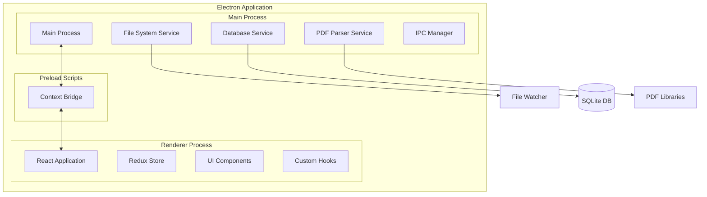
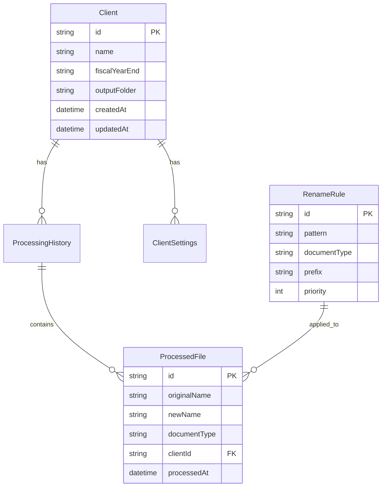

# アーキテクチャ設計書

## 1. システム概要

### 1.1 アーキテクチャ概観



### 1.2 設計原則

1. **関心の分離**: メインプロセスとレンダラープロセスの責務を明確に分離
2. **型安全性**: TypeScriptによる完全な型定義
3. **テスタビリティ**: 依存性注入とインターフェースによるテスト容易性
4. **セキュリティ**: Context Isolationとサンドボックス化
5. **拡張性**: プラグインアーキテクチャによる将来の拡張対応

## 2. レイヤーアーキテクチャ

### 2.1 レイヤー構成

```
┌─────────────────────────────────────┐
│         Presentation Layer          │
│        (React Components)           │
├─────────────────────────────────────┤
│         Application Layer           │
│    (Redux Store, Custom Hooks)      │
├─────────────────────────────────────┤
│          Domain Layer               │
│    (Business Logic, Entities)       │
├─────────────────────────────────────┤
│       Infrastructure Layer          │
│   (File System, Database, IPC)      │
└─────────────────────────────────────┘
```

### 2.2 各レイヤーの責務

#### Presentation Layer
- UIコンポーネントの実装
- ユーザー入力の処理
- 画面表示ロジック

#### Application Layer
- アプリケーション状態管理（Redux）
- ユースケースの実装
- プロセス間通信の抽象化

#### Domain Layer
- ビジネスロジックの実装
- エンティティ定義
- ドメインサービス

#### Infrastructure Layer
- 外部システムとの連携
- データ永続化
- ファイルシステム操作

## 3. プロセス間通信（IPC）

### 3.1 IPC設計パターン

```typescript
// shared/types/ipc.ts
export interface IPCChannel<TRequest, TResponse> {
  name: string;
  request: TRequest;
  response: TResponse;
}

// 型安全なチャンネル定義
export const FileChannels = {
  SCAN_FILES: {
    name: 'file:scan',
    request: { folder: string },
    response: { files: FileInfo[] }
  }
} as const;
```

### 3.2 IPCハンドラー実装

```typescript
// main/ipc/handlers/fileHandler.ts
export class FileHandler {
  constructor(
    private fileService: FileService,
    private logger: Logger
  ) {}

  register(ipcMain: IpcMain) {
    ipcMain.handle(FileChannels.SCAN_FILES.name, async (event, request) => {
      try {
        const files = await this.fileService.scanFolder(request.folder);
        return { success: true, data: files };
      } catch (error) {
        this.logger.error('File scan failed', error);
        return { success: false, error: error.message };
      }
    });
  }
}
```

### 3.3 レンダラー側の実装

```typescript
// renderer/services/ipc.ts
export class IPCService {
  async scanFiles(folder: string): Promise<FileInfo[]> {
    const response = await window.electronAPI.invoke(
      FileChannels.SCAN_FILES.name,
      { folder }
    );
    
    if (!response.success) {
      throw new Error(response.error);
    }
    
    return response.data;
  }
}
```

## 4. 状態管理アーキテクチャ

### 4.1 Redux Store構造

```typescript
// renderer/store/types.ts
export interface RootState {
  files: FilesState;
  settings: SettingsState;
  clients: ClientsState;
  ui: UIState;
}

export interface FilesState {
  items: FileItem[];
  loading: boolean;
  error: string | null;
  filter: FileFilter;
}
```

### 4.2 Slice実装パターン

```typescript
// renderer/store/slices/filesSlice.ts
const filesSlice = createSlice({
  name: 'files',
  initialState,
  reducers: {
    // 同期的なアクション
    setFilter: (state, action) => {
      state.filter = action.payload;
    }
  },
  extraReducers: (builder) => {
    // 非同期アクション
    builder
      .addCase(scanFiles.pending, (state) => {
        state.loading = true;
      })
      .addCase(scanFiles.fulfilled, (state, action) => {
        state.items = action.payload;
        state.loading = false;
      });
  }
});
```

## 5. ファイル処理アーキテクチャ

### 5.1 ファイル監視システム

```typescript
// main/services/FileWatcher.ts
export class FileWatcher {
  private watcher: FSWatcher;
  private eventEmitter: EventEmitter;
  
  constructor(
    private config: WatcherConfig,
    private logger: Logger
  ) {
    this.eventEmitter = new EventEmitter();
  }
  
  start(folders: string[]) {
    this.watcher = chokidar.watch(folders, {
      ignored: /(^|[\/\\])\../,
      persistent: true,
      ignoreInitial: true,
      awaitWriteFinish: {
        stabilityThreshold: 2000,
        pollInterval: 100
      }
    });
    
    this.watcher
      .on('add', this.handleFileAdded.bind(this))
      .on('error', this.handleError.bind(this));
  }
  
  private async handleFileAdded(path: string) {
    if (this.isTargetFile(path)) {
      const fileInfo = await this.getFileInfo(path);
      this.eventEmitter.emit('file:detected', fileInfo);
    }
  }
}
```

### 5.2 PDF解析パイプライン

```typescript
// main/services/PDFParser.ts
export class PDFParser {
  private parsers: IPDFParser[];
  
  constructor() {
    // 複数の解析戦略を登録
    this.parsers = [
      new TextBasedParser(),
      new MetadataParser(),
      new OCRParser() // 将来実装
    ];
  }
  
  async parse(filePath: string): Promise<ParsedDocument> {
    const results = await Promise.all(
      this.parsers.map(parser => parser.tryParse(filePath))
    );
    
    // 最も信頼度の高い結果を採用
    return this.selectBestResult(results);
  }
}
```

## 6. データベース設計

### 6.1 エンティティ関係図



### 6.2 Repository パターン

```typescript
// main/repositories/ClientRepository.ts
export interface IClientRepository {
  findAll(): Promise<Client[]>;
  findById(id: string): Promise<Client | null>;
  save(client: Client): Promise<Client>;
  delete(id: string): Promise<void>;
}

export class ClientRepository implements IClientRepository {
  constructor(private db: Database) {}
  
  async findAll(): Promise<Client[]> {
    const rows = this.db.prepare('SELECT * FROM clients').all();
    return rows.map(row => this.mapToEntity(row));
  }
  
  private mapToEntity(row: any): Client {
    return new Client({
      id: row.id,
      name: row.name,
      fiscalYearEnd: row.fiscal_year_end,
      outputFolder: row.output_folder
    });
  }
}
```

## 7. セキュリティアーキテクチャ

### 7.1 プロセス分離

```typescript
// main/security/sandbox.ts
export function createSecureWindow(): BrowserWindow {
  return new BrowserWindow({
    webPreferences: {
      contextIsolation: true,
      nodeIntegration: false,
      sandbox: true,
      webSecurity: true,
      preload: path.join(__dirname, 'preload.js')
    }
  });
}
```

### 7.2 API露出の制限

```typescript
// main/preload.ts
contextBridge.exposeInMainWorld('electronAPI', {
  // 必要最小限のAPIのみ露出
  scanFiles: (folder: string) => ipcRenderer.invoke('file:scan', folder),
  renameFile: (params: RenameParams) => ipcRenderer.invoke('file:rename', params),
  // ファイルシステムへの直接アクセスは露出しない
});
```

## 8. エラーハンドリング戦略

### 8.1 エラー分類

```typescript
// shared/errors/index.ts
export class AppError extends Error {
  constructor(
    message: string,
    public code: string,
    public statusCode: number,
    public isOperational: boolean = true
  ) {
    super(message);
  }
}

export class FileSystemError extends AppError {
  constructor(message: string, originalError?: Error) {
    super(message, 'FILE_SYSTEM_ERROR', 500);
  }
}

export class ValidationError extends AppError {
  constructor(message: string, field?: string) {
    super(message, 'VALIDATION_ERROR', 400);
  }
}
```

### 8.2 グローバルエラーハンドラー

```typescript
// main/utils/errorHandler.ts
export class GlobalErrorHandler {
  constructor(private logger: Logger) {
    this.setupHandlers();
  }
  
  private setupHandlers() {
    process.on('uncaughtException', (error) => {
      this.logger.error('Uncaught Exception:', error);
      
      if (!this.isOperationalError(error)) {
        process.exit(1);
      }
    });
    
    process.on('unhandledRejection', (reason, promise) => {
      this.logger.error('Unhandled Rejection:', reason);
    });
  }
}
```

## 9. パフォーマンス最適化

### 9.1 遅延読み込み

```typescript
// renderer/App.tsx
const Settings = lazy(() => import('./pages/Settings'));
const History = lazy(() => import('./pages/History'));

function App() {
  return (
    <Suspense fallback={<LoadingSpinner />}>
      <Routes>
        <Route path="/settings" element={<Settings />} />
        <Route path="/history" element={<History />} />
      </Routes>
    </Suspense>
  );
}
```

### 9.2 Worker Threads活用

```typescript
// main/workers/pdfWorker.ts
import { Worker } from 'worker_threads';

export class PDFWorkerPool {
  private workers: Worker[] = [];
  private queue: TaskQueue<ParseTask>;
  
  constructor(private poolSize: number = 4) {
    this.initializeWorkers();
  }
  
  async parse(filePath: string): Promise<ParsedDocument> {
    const worker = await this.getAvailableWorker();
    
    return new Promise((resolve, reject) => {
      worker.postMessage({ type: 'PARSE', filePath });
      
      worker.once('message', (result) => {
        if (result.error) {
          reject(new Error(result.error));
        } else {
          resolve(result.data);
        }
        
        this.releaseWorker(worker);
      });
    });
  }
}
```

## 10. 拡張性設計

### 10.1 プラグインアーキテクチャ

```typescript
// shared/plugins/types.ts
export interface IPlugin {
  name: string;
  version: string;
  initialize(context: PluginContext): Promise<void>;
  execute(params: any): Promise<any>;
  destroy(): Promise<void>;
}

export interface PluginContext {
  logger: Logger;
  config: Config;
  eventBus: EventEmitter;
  registerRenameRule(rule: RenameRule): void;
  registerFileParser(parser: IFileParser): void;
}
```

### 10.2 将来の拡張ポイント

1. **API連携モジュール**
   - マネーフォワードAPI
   - 申告の達人API
   - その他会計ソフトAPI

2. **OCR機能**
   - スキャンPDFの文字認識
   - 手書き文字の認識

3. **AI/ML統合**
   - 書類分類の精度向上
   - 異常検知

4. **クラウド同期**
   - 設定の同期
   - 処理履歴の共有