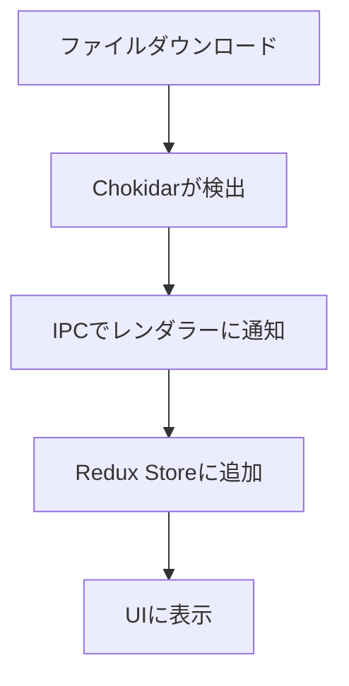
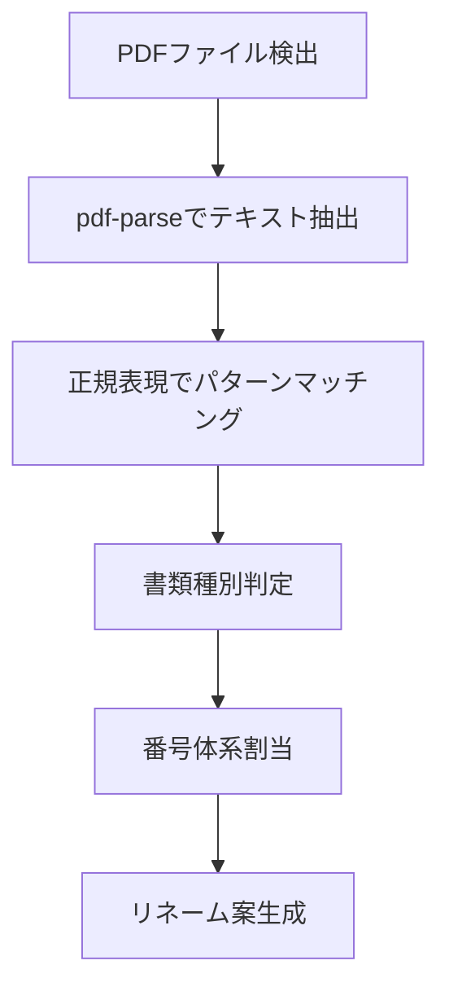

# 技術仕様書 - 税務書類自動リネーム・振り分けシステム

## 1. 技術スタック

### 1.1 コア技術
- **フレームワーク**: Electron v28.x
- **フロントエンド**: React 18.x + TypeScript 5.x
- **状態管理**: Redux Toolkit 2.x
- **ビルドツール**: Vite 5.x + electron-vite
- **パッケージング**: electron-builder 24.x

### 1.2 主要ライブラリ

#### PDF処理
- **pdf-parse**: PDF内容のテキスト抽出
- **pdf-lib**: PDFメタデータ読み取り
- **pdfjs-dist**: PDFプレビュー表示

#### ファイル操作
- **fs-extra**: 拡張ファイルシステム操作
- **chokidar**: ファイル監視
- **node-watch**: バックアップ用ファイル監視

#### UI/UX
- **@mui/material**: Material Design コンポーネント
- **react-beautiful-dnd**: ドラッグ&ドロップ
- **react-hook-form**: フォーム管理
- **react-toastify**: 通知表示

#### データベース
- **better-sqlite3**: SQLite操作
- **typeorm**: ORM（型安全なDB操作）

## 2. プロジェクト構造

```
tax-filenamechanger/
├── src/
│   ├── main/                    # Electronメインプロセス
│   │   ├── index.ts            # エントリーポイント
│   │   ├── preload.ts          # プリロードスクリプト
│   │   ├── ipc/                # IPC通信
│   │   │   ├── handlers/       # IPCハンドラー
│   │   │   └── channels.ts     # チャンネル定義
│   │   ├── services/           # ビジネスロジック
│   │   │   ├── FileWatcher.ts # ファイル監視
│   │   │   ├── PDFParser.ts   # PDF解析
│   │   │   ├── FileRenamer.ts # リネーム処理
│   │   │   └── Database.ts    # DB操作
│   │   └── utils/              # ユーティリティ
│   │
│   ├── renderer/               # Electronレンダラープロセス
│   │   ├── index.tsx          # Reactエントリー
│   │   ├── App.tsx            # メインコンポーネント
│   │   ├── components/        # UIコンポーネント
│   │   │   ├── FileList/      # ファイル一覧
│   │   │   ├── Preview/       # プレビュー
│   │   │   ├── Settings/      # 設定画面
│   │   │   └── common/        # 共通コンポーネント
│   │   ├── hooks/             # カスタムフック
│   │   ├── store/             # Redux store
│   │   │   ├── slices/        # Redux slices
│   │   │   └── index.ts       # Store設定
│   │   ├── services/          # API通信層
│   │   └── utils/             # ユーティリティ
│   │
│   └── shared/                # 共有コード
│       ├── types/             # TypeScript型定義
│       ├── constants/         # 定数
│       └── utils/             # 共有ユーティリティ
│
├── resources/                 # リソースファイル
│   ├── icons/                # アプリアイコン
│   └── installer/            # インストーラー用
│
├── tests/                    # テスト
│   ├── unit/                # 単体テスト
│   ├── integration/         # 統合テスト
│   └── e2e/                # E2Eテスト
│
└── scripts/                 # ビルドスクリプト
```

## 3. データフロー

### 3.1 ファイル検出フロー


### 3.2 PDF解析フロー


## 4. セキュリティ設計

### 4.1 Electron セキュリティ
```typescript
// main/index.ts
const mainWindow = new BrowserWindow({
  webPreferences: {
    contextIsolation: true,         // コンテキスト分離
    nodeIntegration: false,         // Node.js統合無効化
    sandbox: true,                  // サンドボックス有効化
    preload: path.join(__dirname, 'preload.js')
  }
});

// Content Security Policy
session.defaultSession.webRequest.onHeadersReceived((details, callback) => {
  callback({
    responseHeaders: {
      ...details.responseHeaders,
      'Content-Security-Policy': ["default-src 'self'"]
    }
  });
});
```

### 4.2 データ保護
- SQLiteデータベースの暗号化（SQLCipher）
- 設定ファイルの暗号化（crypto-js）
- ファイル操作の権限チェック

## 5. パフォーマンス最適化

### 5.1 起動時間短縮
- **遅延読み込み**: 必要なモジュールのみ初期ロード
- **プリロード**: 頻繁に使用するデータのキャッシュ
- **システムトレイ常駐**: 2回目以降の起動高速化

### 5.2 ファイル処理最適化
- **バッチ処理**: 複数ファイルの並列処理
- **Worker Threads**: CPU集約的なPDF解析を別スレッドで実行
- **ストリーミング**: 大きなPDFファイルの段階的処理

## 6. エラーハンドリング

### 6.1 グローバルエラーハンドラー
```typescript
// main/index.ts
process.on('uncaughtException', (error) => {
  logger.error('Uncaught Exception:', error);
  // ユーザーに通知 + graceful shutdown
});

// renderer/index.tsx
window.addEventListener('unhandledrejection', (event) => {
  logger.error('Unhandled Promise Rejection:', event.reason);
  // エラー通知表示
});
```

### 6.2 ファイル操作エラー
- 権限不足: 管理者権限での再実行を提案
- ファイルロック: リトライ機構
- ディスク容量不足: 事前チェックと警告

## 7. ロギング設計

### 7.1 ログレベル
- **ERROR**: エラー発生時
- **WARN**: 警告（リトライ可能なエラー等）
- **INFO**: 重要な処理の開始/終了
- **DEBUG**: 詳細なデバッグ情報

### 7.2 ログ保存
```typescript
// 保存先: %APPDATA%/tax-filenamechanger/logs/
// ファイル名: app-YYYY-MM-DD.log
// ローテーション: 7日間保持
```

## 8. 設定管理

### 8.1 設定ファイル構造
```json
{
  "app": {
    "autoStart": true,
    "minimizeToTray": true,
    "theme": "light"
  },
  "watcher": {
    "folders": ["C:\\Users\\username\\Downloads"],
    "fileTypes": [".pdf", ".csv"],
    "pollInterval": 1000
  },
  "rename": {
    "rules": {
      "法人税": { "prefix": "0001", "category": "法人税" },
      "消費税": { "prefix": "3001", "category": "消費税" }
    },
    "backup": true
  },
  "clients": [
    {
      "id": "uuid",
      "name": "クライアントA株式会社",
      "fiscalYearEnd": "2505",
      "outputFolder": "D:\\税務書類\\クライアントA\\2505期"
    }
  ]
}
```

## 9. ビルド設定

### 9.1 electron-builder設定
```yaml
# electron-builder.yml
appId: com.taxdoc.renamer
productName: 税務書類リネーマー
directories:
  output: dist
  buildResources: resources
files:
  - src/main/dist/**/*
  - src/renderer/dist/**/*
  - package.json
win:
  target:
    - nsis
    - portable
  icon: resources/icons/icon.ico
  certificateFile: cert.pfx
  publisherName: "Your Company"
nsis:
  oneClick: false
  allowToChangeInstallationDirectory: true
  createDesktopShortcut: true
  createStartMenuShortcut: true
```

## 10. 依存関係

### 10.1 本番依存関係
```json
{
  "dependencies": {
    "electron": "^28.0.0",
    "react": "^18.2.0",
    "react-dom": "^18.2.0",
    "@reduxjs/toolkit": "^2.0.1",
    "react-redux": "^9.0.4",
    "@mui/material": "^5.15.0",
    "pdf-parse": "^1.1.1",
    "chokidar": "^3.5.3",
    "better-sqlite3": "^9.2.2",
    "fs-extra": "^11.2.0",
    "winston": "^3.11.0"
  }
}
```

### 10.2 開発依存関係
```json
{
  "devDependencies": {
    "@types/react": "^18.2.45",
    "typescript": "^5.3.3",
    "vite": "^5.0.10",
    "electron-vite": "^2.0.0",
    "electron-builder": "^24.9.1",
    "@testing-library/react": "^14.1.2",
    "jest": "^29.7.0",
    "playwright": "^1.40.1",
    "eslint": "^8.56.0",
    "prettier": "^3.1.1"
  }
}
```